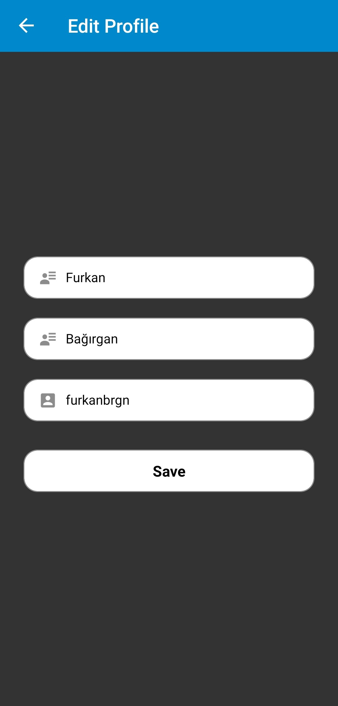

# Telegram Example
In this project, an application with user login and messaging was developed by taking the telegram application as an example. The user logs into the application with his/her phone number, name, surname and user name. In the application, there are contacts that the user can message on the contacts screen. The list of these people is stored on the context as mock data. In addition, there are people with whom he has messaged before on the messages screen. The information here is kept dynamically on the context over the messages sent by the user. The user can change the application theme and user information from the settings screen and can log out if desired.

## Used technologies
- React Native CLI
- React Native Navigation
- React Native Vector Icons
- React Native Picker
- React Native AsyncStorage
- React Native Moment

## Screens
<div>
<kbd></kbd>
<kbd></kbd>
<kbd></kbd>
</div>
<div>
<kbd></kbd>
<kbd></kbd>
<kbd></kbd>
</div>
<div>
<kbd></kbd>
<kbd></kbd>
</div>
<div>
<kbd></kbd>
<kbd></kbd>
<kbd></kbd>
</div>
<div>
<kbd></kbd>
<kbd></kbd>
<kbd></kbd>
</div>

## Installation
1.Clone Project
```
git clone https://github.com/furkanbagirgan/Telegram-Example.git
```
2.Install the Necessary Packages for Project
```
npm install
```
3.Run Project To Emulator or Real Device
```
npx react-native start & npx react-native run-android
```
